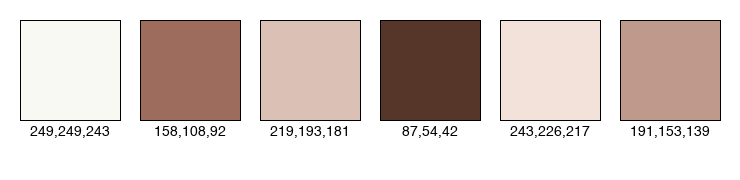

# gifRecolor

A collection of scripts to recolor GIFs using k-means clustering and color replacements.

## Usage
* Identify the key colors in the gif using the analyze_colors.py script.
* Visualize the colors using the visualize_palette.py script and the centroids text file in outputs.
* Create a replacements.json file with the colors to replace.
* Run the recolor.py script.
```bash
python3 kmeans.py <input_gif> <output_gif> <n_clusters>
python3 visualize_palette.py <centroids_file> <output_image>
python3 recolor.py <input_gif> <output_gif> <replacements_file>
```

## Preprocessing
K-means clustering is used to find the most representative colors in the gif, then the colors in the gif are replaced with the closest colors found by k-means. This way, we can reduce the number of colors in the gif and make it easier to recolor.

## Results

### Original


### Step 1: K-Means Clustering (Color Reduction)
Reduced to 6 colors.


### Palette Analysis
The 6 centroids found by K-Means.



### Step 2: Color Replacement
Replaced colors based on `replacements.json`.


## Color replacement
With the colors found by k-means, the new colors in the gif are replaced with colors as specified in the replacements.json file.
